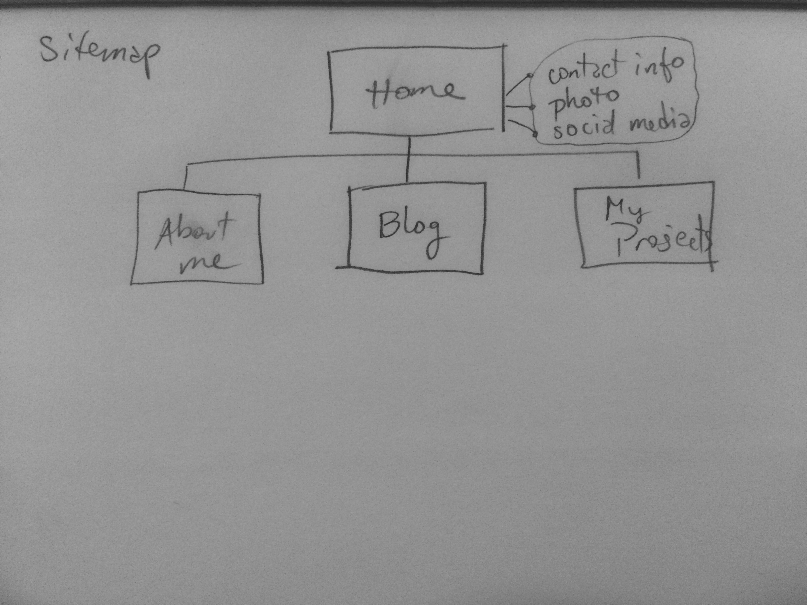

*What are the 6 Phases of Web Design?*
1. Information Gathering
2. Planning
3. Design
4. Development
5. Testing & Delivery
6. Maintenance

*What is your site's primary goal or purpose? What kind of content will your site feature?*
My site's primary goal is to set up a simple, attractive online presence for myself, providing information about my projects, my interests and ways to get in touch with me.

*What is your target audience's interests and how do you see your site addressing them?*
My target audience will mostly be future employers and other web development professionals (hopefully both), interested in finding more information about me as someone to work with, or interested in my projects or blog for fun or inspiration. My site will focus on clean, spare design, so that the information I want to provide will be dead-simple to find and access for my audience.

*What is the primary "action" the user should take when coming to your site? Do you want them to search for information, contact you, or see your portfolio? It's ok to have several actions at once, or different actions for different kinds of visitors.*
The primary action for my site will be looking at my portfolio/blog and contacting me. Since I won't pretend to be an expert with a ton of information yet, searching will be limited to my contact info.

*What are the main things someone should know about design and user experience?*
The process of web design is multi-faceted and **not** purely visual. The signs of a successfully designed website include visual interest, clear structure, and intuitive interactions.
User experience studies how users interact with a system, like a website. User experience can be improved based on qualitative, emotional data from users, and that data is used to elevate the users' reactions to using the system.

*What is user experience design and why is it valuable?*
User experience is a field that focuses on the emotions of the user as they interact with a system— in this case, a website or web app. As web sites and services permeate the lives of more people, UX design has the opportunity and goal of making everyone's experiences more intuitive, pleasant, and easy.

*Which parts of the challenge did you find tedious?*
I loved reading about web design and UX, actually. The number of resources at the end of the UX blog post was intimidating and I sort of glazed over after looking at 15 or so of the websites.