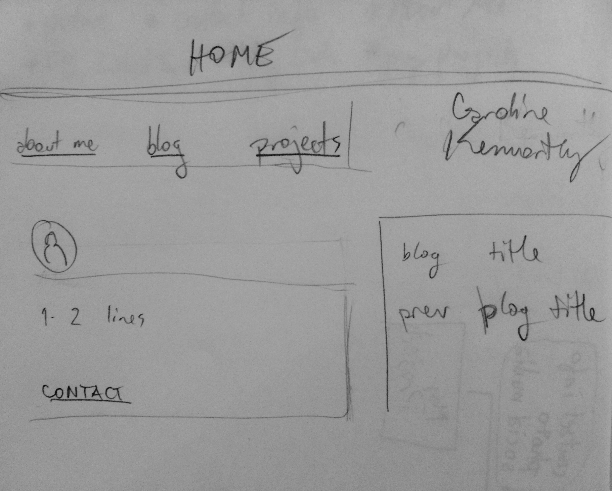
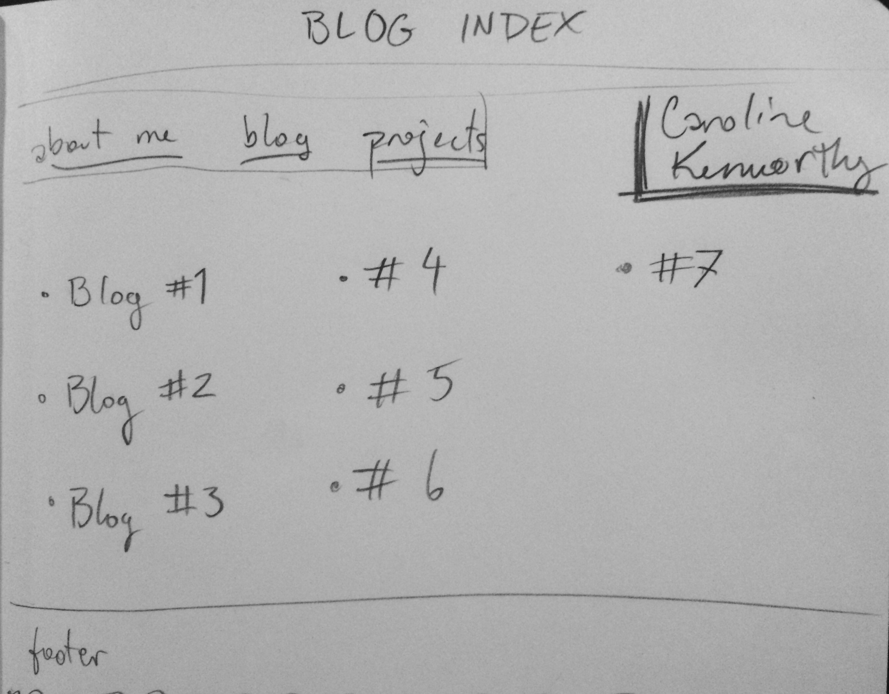

*What is a wireframe?*
A wireframe is a visual mockup of the structure of a webpage. It can be on paper or in a file; it's usually in black & white; it consists of boxes which are assigned HTML elements like header, body, or footer.

*What are the benefits of wireframing?*
Since websites are almost always informational structures expressed through visual structures, wireframing aids a designer in determining more effective, expressive methods for displaying the information. It's an essentially brainstorm-y step of the design process for a website, which helps avoid unclear or ineffective design implementation.

*Did you enjoy wireframing your site?*
Yes! I think my sketches rely too much on my own assumptions about how I want my website to look, though; I could work on making my wireframe titles/boxes and whitespace more clear to others.

*Did you revise your wireframe or stick with your first idea?*
I stuck with one or two of my first ideas, like placing the nav bar at the top, but using pencil and paper helped me play around with where I wanted visually heavy elements like my photo, and information I want to highlight, like my contact info.

*What questions did you ask during this challenge? What resources did you find to help you answer them?*
When we're learning a generalized new concept like this, most of my questions relate more to established uses and conventions. If a professional were to sketch out 10 basic wireframes, which elements would show up in every one? If mine doesn't look like theirs, I want to at least understand the differences. Anyway, I read the articles and clicked most of the links that they listed as references to get a feel for wireframing. I particularly like the extenstion [http://www.wirify.com/](Wirify)!

*Which parts of the challenge did you enjoy and which parts did you find tedious?*
I enjoy the design process quite a lot, so messing around with my site design was fun. The tedious parts for me were sort of the other side of the same coin— I kept fussing with the design and drawing boxes around elements to clarify them or adding weight to the lines, and... uploading that picture a bunch of times was kind of annoying.