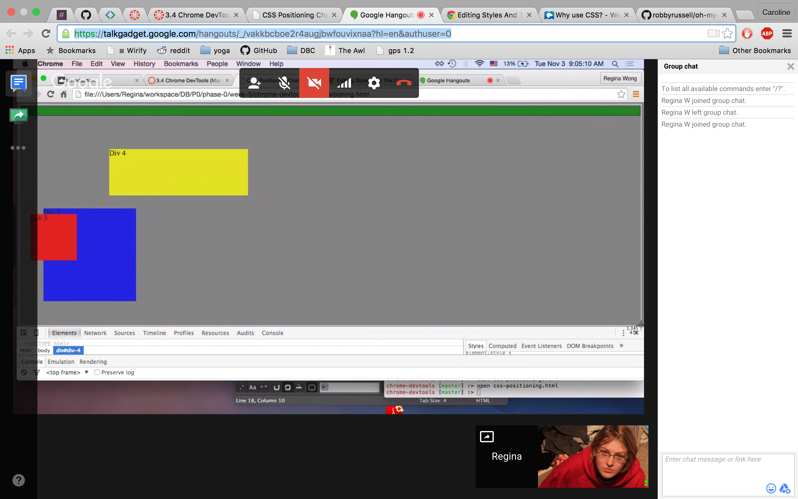
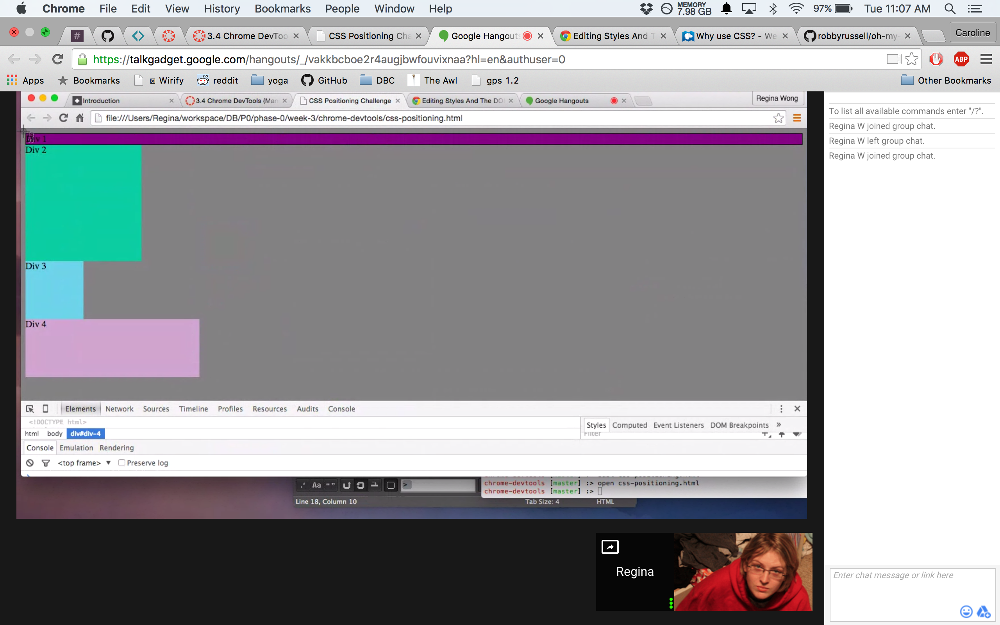
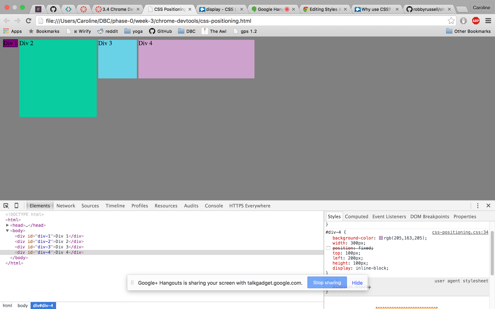
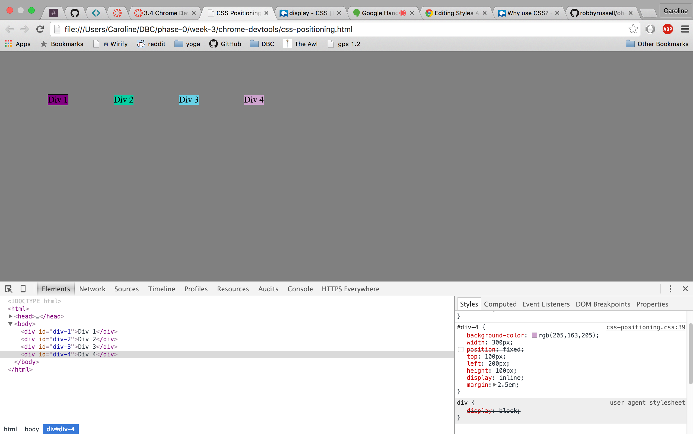
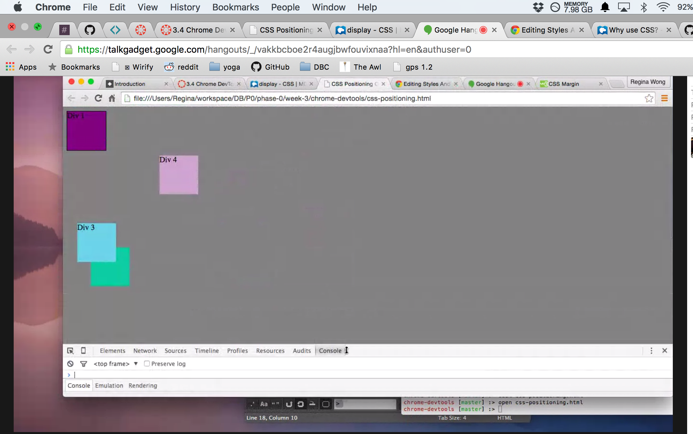
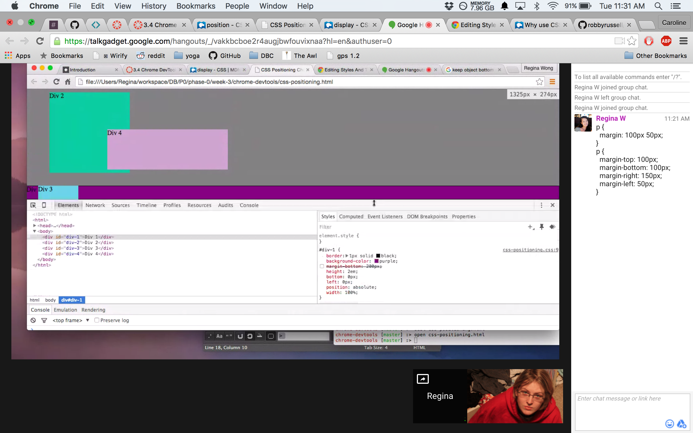
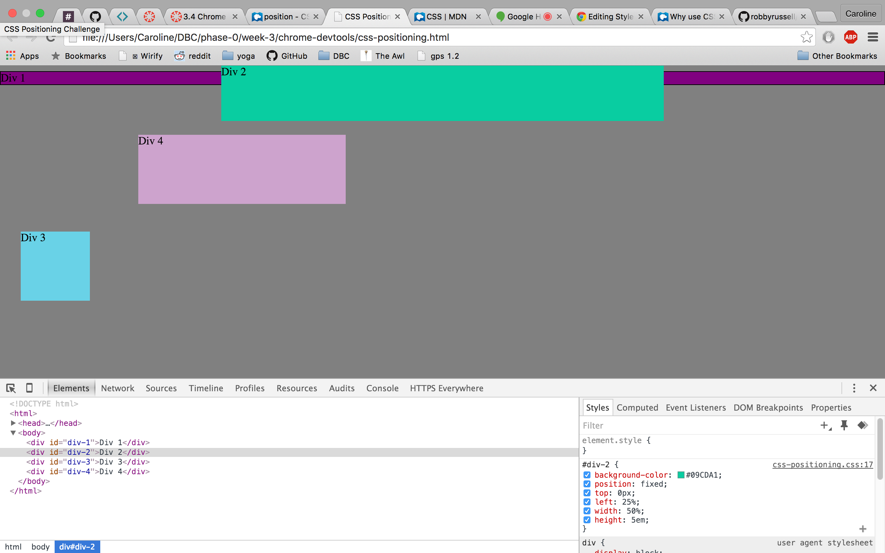
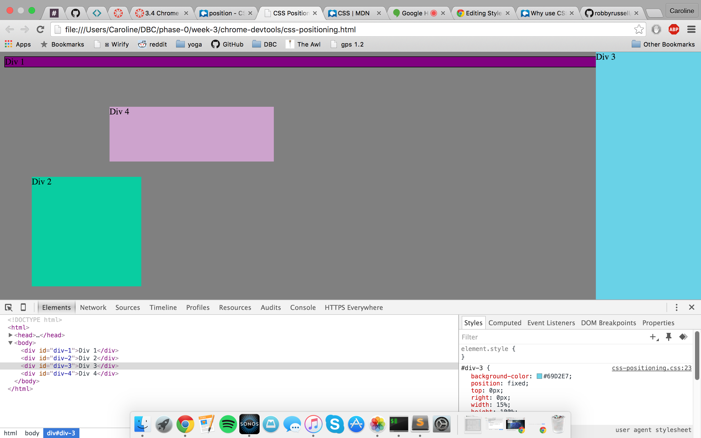
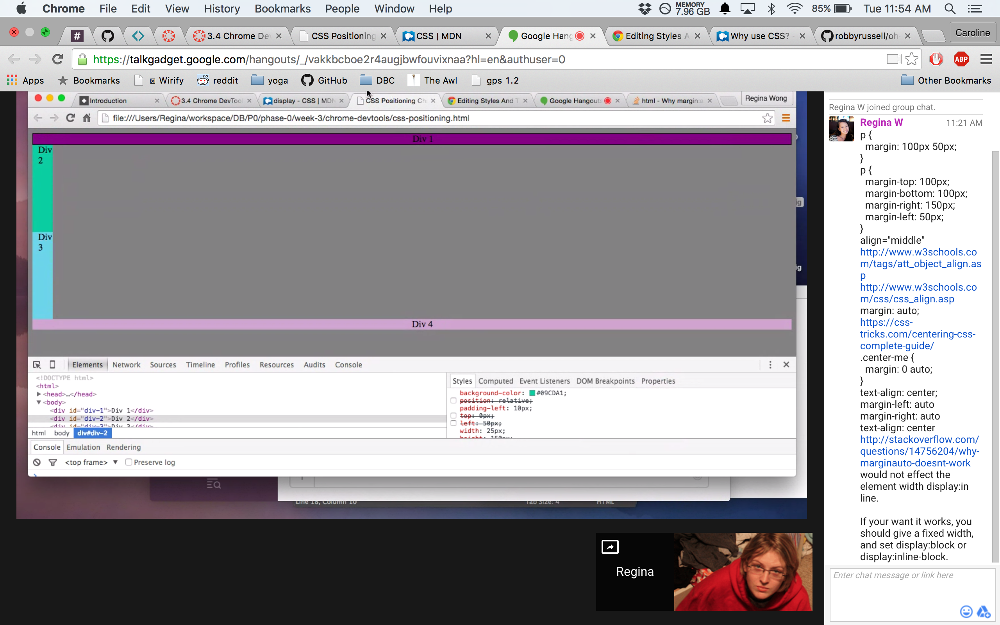

1. How can you use Chrome's DevTools inspector to help you format or position elements?
Chrome's inspector is useful for playing with the formatting and structure of webpages because it interacts immediately with the page and the code. By messing with the positioning of a certain element, I was able to test out what certain attributes do or don't do.

2. How can you resize elements on the DOM using CSS?
By calling the appropriate element in a CSS file, and adjusting the value of the `width` and `height` attributes.

3. What are the differences between absolute, fixed, static, and relative positioning? Which did you find easiest to use? Which was most difficult?
  * Static positioning is the **default positioning** of all DOM elements. It lists elements vertically from first to last.
  * Relative positioning adjusts an element's placement relative to HTML's normal treatment of elements (static positioning).
  * Absolute positioning assigns a location to an element **relative to the element in which it is nested**, or its immediate parent branch on the DOM.
  * Fixed positioning assigns an element to one location in the viewport (aka the browser window). This is a kind of absolute positioning; the element will not move within the browser window despite scrolling.
Relative and absolute positioning are by far the hardest for me to interact with; visualizing which box the element I'm positioning is reacting to can be difficult.

4. What are the differences between margin, border, and padding?
Going from the outside to the inside:
  * Margin is the adjustable space surrounding an element, and can be widened or reduced on all four sides as much as the screen will allow.
  * Border is the rim along the edge of an element 9and can be styled to highlight it if desired).
  * Padding is the adjustable space *within* an element, between the element's visible content and its border. For instance, a `
` with `background-color: red` and `padding-top: 1em` will display an `` (within the `
`) with 1em of red background above it.

5. What was your impression of this challenge overall? (love, hate, and why?)
I love messing around with CSS, and the progression of difficulty between each exercise was stimulating. Reacquainting myself with the quirks of positioning and CSS syntax felt good, and I feel more prepared to tackle the look of my website.