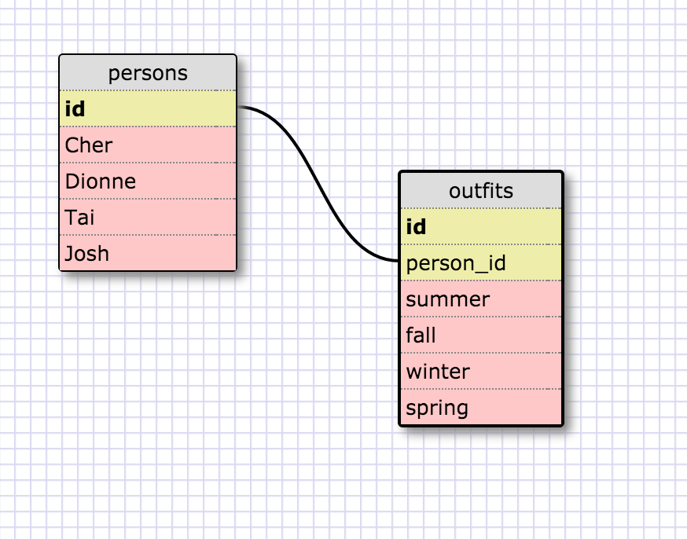

8.4 SQL querying

1.
SELECT * FROM states;

2.
SELECT * FROM regions;

3.
SELECT state_name,population FROM states;

4.
SELECT state_name,population
FROM states
ORDER BY population DESC;

5.
SELECT state_name FROM states
WHERE region_id IN (7);

6.
SELECT state_name,population_density
FROM states
WHERE population_density > 50
ORDER BY population_density;

7.
SELECT state_name FROM states
WHERE population BETWEEN 1000000 AND 1500000;

8.
SELECT state_name,region_id
FROM states
ORDER BY region_id;

9.
SELECT * FROM regions
WHERE region_name LIKE '%Central';

10.
SELECT region_name, state_name
FROM regions, states
WHERE states.region_id=regions.id
ORDER BY region_name ASC;

**Clueless Schema:**

*// Reflection*

**What are databases for?**

Databases are for managing large amounts of related data. They're often expressed in tables that keep track of declared kinds (fields) of information for individual entities (in a row, or tuple).

**What is a one-to-many relationship?**

A one-to-many relationship is the relationship that exists between a category which classifies objects, and the objects that are classified by a category. There is one category for many objects, and many objects have one category. Often the levels of categorizing are shown in multiple tables in databases, such as the separated tables for states and regions. (Since regions contain states, it's more useful to enter them separately in a database.)

**What is a primary key? What is a foreign key? How can you determine which is which?**

A primary key is the field of a table which holds unique keys assigned to each individual entity's information, so that in the event that there were two entities with identical information, their data in the table would not in fact be in duplicate.

When databases become complex, using more than one table becomes prudent for tracking information sensibly. So given two tables, one original and one related, a foreign key is a field of the original table which points to the related table's information.

Typically a primary key is a list of incrementing numbers in a field named (something like) "id". A foreign key will point to another table with another set of numbers, but would have a more informative name, like "region_id".

**How can you select information out of a SQL database? What are some general guidelines for that?**

The SQL code for selecting/displaying information from a database looks like this:

  `SELECT [field_name],[maybe_another_field_name] FROM [table_name];`

It will print out all the data from those two fields lined up to each other.
You can specify parameters for the information as well, like:

  `SELECT [field_name],[other_field_name]`

  `FROM [table_name]`

  `ORDER BY [other_field_name];`

Make sure the field names and table name(s) are properly typed, and close with a semicolon. The docs on W3Schools are useful, partially because the key words of the language are pretty intuitive: WHERE takes a condition and returns data that fits that condition, which almost reads like English.

